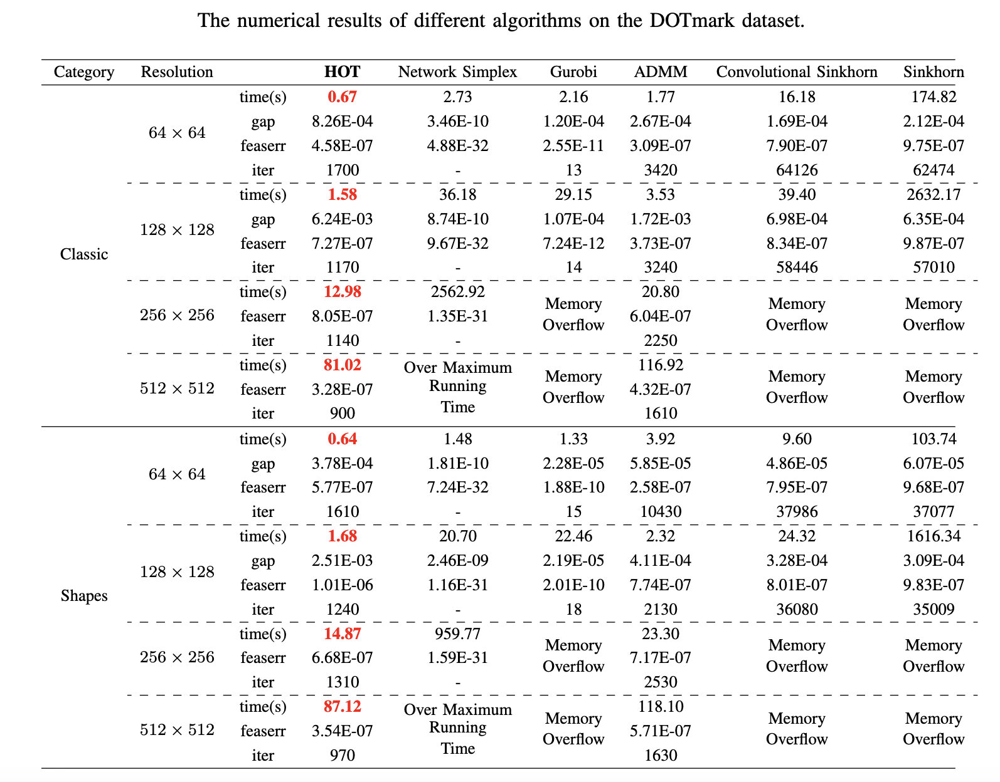

<!--
 * @author: Zhexuan Gu
 * @Date: 2024-11-18 14:58:53
 * @LastEditTime: 2024-11-18 23:11:37
 * @FilePath: /HOT/README.md
 * @Description: Please implement
-->

**<h1 style="text-align:center;">         HOT     : An Efficient Halpern Accelerating Algorithm
for Optimal Transport Problems         </h1>**

<!-- [![Contributors][contributors-shield]][contributors-url]
[![Forks][forks-shield]][forks-url]
[![Stargazers][stars-shield]][stars-url] -->

**This is the official implementation of the HOT solver, a highly efficient algorithm for solving reduced 2D optimal transport problems.**


## Overview
HOT is designed to solve 2D optimal transport problems efficiently, formulated as a standard linear programming problem:

[  
  \begin{equation}\label{model:standLP}
\begin{array}{ll}
\min\limits_{x \in \mathbb{R}^N} & \langle{c}, {x}\rangle  + \delta_{\mathbb{R}_{+}^{N}}(x)\\
         \text { s.t. } &{A} {x}={b}.
\end{array}
\end{equation} 
]

By leveraging the sparse structure of matrix $A$ for given 2D histogram with $m$ rows and $n$ columns, HOT avoids explicit matrix generation, enhancing computational efficiency.


<!-- GETTING STARTED -->
## Getting Started
### Prerequisites

First, install the necessary packages listed in requirements.txt.

  ```sh
  pip install -r requirements.txt
  ```

### Example: Solving an OT Problem Between Two Grayscale Images
  ```sh
  python -m demo.py
  ```
The pipeline of this demo is like following: 
<ol>
<li>Specify the paths to the two images used for the OT problem.</li>
<li>Specify the desired crop size of two images.</li>
<li>Read the images, convert them to grayscale images and perform $\ell_{1}$ normalization$.</li>
<li>Generate $b$ and $c$.</li>
<li>Exucute the HOT Solver.</li>
</ol>
You can adapt this pipeline to suit your project's needs.


## Results
The HOT solver runs extremely **fast**! :smile:

Apart from the speed, our method has an **advantage on memory** compared to most other baseline algorithms. :grin:
 


## Color transfer


## Notation for ADMM and HOT Solver
On our RTX 4090, we found that the four basic vector operations gradually become a bottleneck as the image resolution increases.

Consequently, we adopt a heuristic block strategy to manually split the too long vector to make it adapted to the size of L1-cache of the GPU which is 16MB for RTX 4090.
```python
# m, n are height and width of the image respectively
# We denote params as N in our manuscript
params = m * m * n + n * n * m
if crop_size < 128:
    blocks = 1
else:
    # params * 8 / 1024**2 is the megabytes the vector takes
    blocks = math.ceil(params * 8 / 1024**2 / 16)
pad = params // blocks
```
:blush:You may need to **adjust parameter 'block'** to replicate our results if you are **not using RTX 4090**!


<!-- Citations -->
## Citations

```bibtex
@article{zhang2025hot,
  title={HOT: An efficient Halpern accelerating algorithm for optimal transport problems},
  author={Zhang, Guojun and Gu, Zhexuan and Yuan, Yancheng and Sun, Defeng},
  journal={IEEE Transactions on Pattern Analysis and Machine Intelligence},
  year={2025},
  publisher={IEEE}
}
```


<!-- MARKDOWN LINKS & IMAGES -->
<!-- https://www.markdownguide.org/basic-syntax/#reference-style-links -->
[contributors-shield]: https://img.shields.io/github/contributors/GUZhexuan/HOT.svg?style=for-the-badge
[contributors-url]: https://github.com/GUZhexuan/HOT/graphs/contributors
[forks-shield]: https://img.shields.io/github/forks/GUZhexuan/HOT.svg?style=for-the-badge
[forks-url]: https://github.com/GUZhexuan/HOT/network/members
[stars-shield]: https://img.shields.io/github/stars/GUZhexuan/HOT.svg?style=for-the-badge
[stars-url]: https://github.com/GUZhexuan/HOT/stargazers